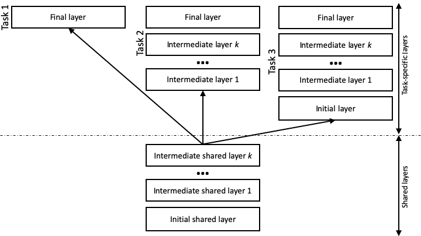

## Multi-task Learning

One core feature of `Metal` is the ability to jointly train multiple task at the same time, with some layers in the architecture being shared between tasks, and some specific to each task. The figure below shows some common scenarios:



```yml
mtl {
  shardsPerEpoch = 10
  maxEpochs = 50
  epochPatience = 5
  numberOfTasks = 3

  layers {
    initial {
      learnedWordEmbeddingSize = 128
      charEmbeddingSize = 32
      charRnnStateSize = 16
      c2i = "org/clulab/c2i-en.txt"
    }

    intermediate1 {
      rnnStateSize = 128
        useHighwayConnections = false
        numLayers = 1
    }
  }

  task1 {
    name = "En POS tagging"
    train = "dynet/en/pos/train.txt"
    dev = "dynet/en/pos/dev.txt"
    test = "dynet/en/pos/test.txt"

    layers {
      final {
        inference = "greedy"
      }
    }
  }

  task2 {
    name = "En chunking"
    train = "dynet/en/chunking/train.txt"
    dev = "dynet/en/chunking/dev.txt"
    test = "dynet/en/chunking/test.txt"

    layers {
      final {
        inference = "viterbi"
      }
    }
  }

  task3 {
    name = "En SRL predicates"
    train = "dynet/en/srl/train.txt"
    dev = "dynet/en/srl/dev.txt"
    test = "dynet/en/srl/test.txt"

    layers {
      final {
        inference = "greedy"
      }
    }
  }
}
```

